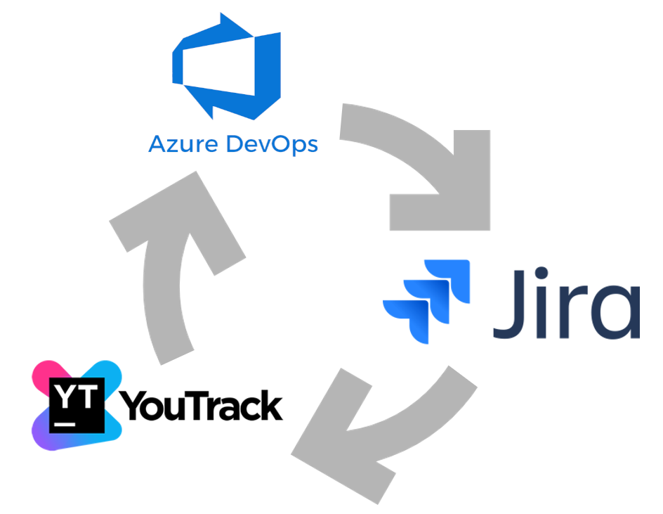
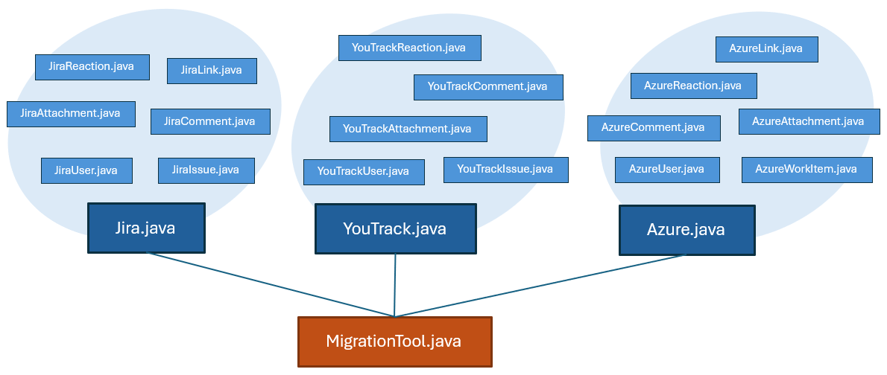

# Migrating between Jira, YouTrack and Azure DevOps




## Background

Migrating between ticket systems is non-trivial.
These systems are incompatible in all possible ways.
It needs to be done in stages in order to preserve item links, and Git history must be rewritten to update commit messages with new ticket numbers.
Among others.

Apart from the pure ticket content, one also want to preserve rich-text, attachments, comments, reactions, wiki links, user IDs and so on.
What complicates matters: Most fields in a  ticket system are custom with custom value sets, which require detailed mapping from source to destination.

There are commersial tools for supporting this operation, but applying this will most certainly be both costly,
time-consuming, painful and suboptimal knowing the massive amount of custom logic required.
And they will anyway not take the associated Git store into consideration.

By controling the logic yourself you keep full control over the process and can tailor it to your exact needs.

GeoSoft **ticketmaster** contains all the basic components needed for migrating between these systems.

Use this code as you starting point for a migration. Or contact [GeoSoft](https://geosoft.no) and we will handle it for you.


## Basic Architechture

Each of the Jira, YouTrack and Azure classes represents the respective server within the program. When pointed to the correct URL,
these will populate the associated ticket classes.



The MigrationTool class contains the overall migration logic. Here mapping between issues from the different systems takes place.

A typical work flow as as follows:

1. Read all issues from a Jira instance
2. Convert each to Azure work item, and push to Azure

In code:

```java
Jira jira = new Jira();
List<JiraIssue> jiraIssues = jira.getIssues();

Azure azure = new Azure();

MigrationTool migrationTool = new MigrationTool();

for (JiraIssue jiraIssue : jiraIssues) {
  AzureWorkItem azureWorkItem = migrationTool.newAzureWorkItem(jiraIssue);
  azure.pushWorkItem(azureWorkItem);
}
```


## Extension

The system was created for migrating from YouTrack and Jira to Azure DevOps. It can easily be tuned to migrate the other way.
Following the same architectual pattern it can also easily be extended to include other systems as long as they provide a
REST API for communication.
